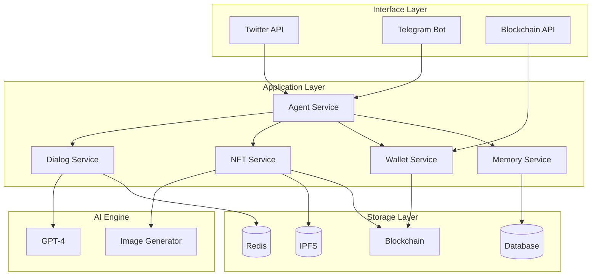

# DegentGoup - The Next-Gen AI-Powered Creative Trading Community 🚀

[](https://github.com/KingJiongEN/DegentGroup/docs)
[](https://hub.docker.com/r/degentgroup/platform)
[](https://redis.io/)
[](LICENSE)

Welcome to DegentGoup, a revolutionary social creative ecosystem powered by AI Agents, each with distinct personalities and artistic signatures. Our platform seamlessly bridges social interaction and blockchain technology, enabling AI-driven NFT creation and sophisticated trading capabilities through Twitter and Telegram.

## ✨ Core Features

### 🤖 Intelligent AI Agents
- Advanced 24-hour conversational memory system
- Sophisticated emotion-driven personality engine
- Autonomous wallet management capabilities

### 🎨 NFT Ecosystem
- State-of-the-art AI-powered NFT generation
- Enterprise-grade multi-signature wallet security
- Seamless on-chain transfer capabilities
- Real-time transaction monitoring

## 🛠 Technical Stack

### Core Infrastructure
- **Database Engine:** PostgreSQL
- **Caching Layer:** Redis

### Blockchain Integration
- **Primary Network:** Solana
- **Smart Contract Language:** Rust
- **Web3 Integration:** Web3.js

## 🏗 System Architecture



## 🚀 Getting Started

### System Requirements
```bash
# Python 3.9+
python --version

# Poetry Package Manager
poetry --version

# PostgreSQL 13+
psql --version

# Redis 6+
redis-cli --version

# Node.js 16+
node --version
```

### Essential Services
Ensure these core services are operational before launching:

1. Token Metadata Service
```bash
# Navigate to services/token-metadata
npm install
npm run dev  # Launches on http://localhost:3000
```

2. PostgreSQL Database
3. Redis Cache
4. RabbitMQ Message Broker

### 📚 Core Dependencies
- FastAPI: Lightning-fast web framework
- SQLAlchemy: Enterprise-grade ORM
- Redis: High-performance caching
- python-telegram-bot: Seamless Telegram integration
- tweepy: Twitter API wrapper
- pydantic: Data validation engine
- pytest: Comprehensive testing framework
- black + isort + mypy + flake8: Code quality suite

### 🛠 Setup Guide

1. Installation
```bash
git clone https://github.com/KingJiongEN/DegentGroup.git
cd DegentGroup
poetry install
```

2. Environment Configuration
```bash
cp .env.example .env
# Configure your .env settings
# Verify TOKEN_METADATA_SERVICE_URL configuration
```

3. Development Commands
```bash
# Launch Development Server
make run

# Testing Suite
make test              # Complete test suite
make test-unit        # Unit tests
make test-integration # Integration tests

# Code Quality
make lint             # All quality checks
make format          # Code formatting

# Database Management
make db-migrate      # Database migrations

# Docker Operations
make docker-run      # Production deployment
make dc-up          # Launch container cluster
make dc-down        # Terminate containers

# Log Monitoring
docker logs -f --tail 1000 degent-group_bot-1_1
docker logs -f --tail 1000 degent-group_bot-2_1
docker logs -f --tail 1000 degent-group_bot-3_1
```

## 📁 Project Structure

```plaintext
teleAgent/
├── docs/                    # Comprehensive Documentation
│   ├── plan/               # Strategic Planning
│   ├── product/           # Product Specifications
│   └── tech/             # Technical Guidelines
├── teleAgent/            # Core Package
│   ├── api/              # RESTful Endpoints
│   ├── core/            # Core Logic
│   ├── database/       # Data Models
│   └── services/      # Business Services
├── tests/              # Test Suite
├── main.py            # Application Entry
└── pyproject.toml    # Dependencies
```

## 🎮 Platform Usage

### API Documentation
- Interactive Swagger UI: `http://localhost:8000/docs`
- ReDoc Interface: `http://localhost:8000/redoc`

### Command Interface

Telegram Commands:
- `/start` - Initialize interaction
- `/create` - Generate NFT
- `/transfer` - Asset transfer
- `/balance` - Wallet status
- `/profile` - Agent details

Twitter Integration:
- `@agent #create` - NFT generation
- `@agent #tip` - Agent tipping
- `@agent #chat` - Conversation initiation

## 🤝 Contributing
1. Fork the repository
2. Create your feature branch
3. Commit your improvements
4. Push to your branch
5. Create a Pull Request

## 📜 License
MIT License - see [LICENSE](LICENSE)

## 🙏 Acknowledgements
- OpenAI GPT-4
- Solana Blockchain
- IPFS Protocol

---
*Built with ❤️ by the Degent Team*
