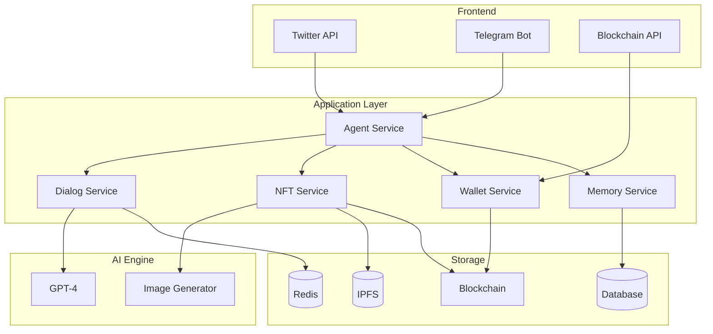

# Degent Group Documentation

Welcome to the Degent Group documentation. Degent Group is an AI-powered chat system that integrates with Telegram and provides NFT creation, bargaining, and artwork generation capabilities.

## System Overview

## Key Features

- 🤖 Telegram Bot Integration
- 🎨 AI Artwork Generation
- 💰 NFT Creation and Trading
- 🤝 Automated Bargaining System
- 👥 Group Chat Management

## Quick Links

- [Installation Guide](getting-started/installation.md)
- [Basic Bot Tutorial](tutorials/basic-bot.md)
- [API Reference](api/telegram.md)
- [Examples](examples/basic.md)

## Support

For support, please [open an issue](https://github.com/KingJiongEN/DegentGroup/issues) on our GitHub repository. 