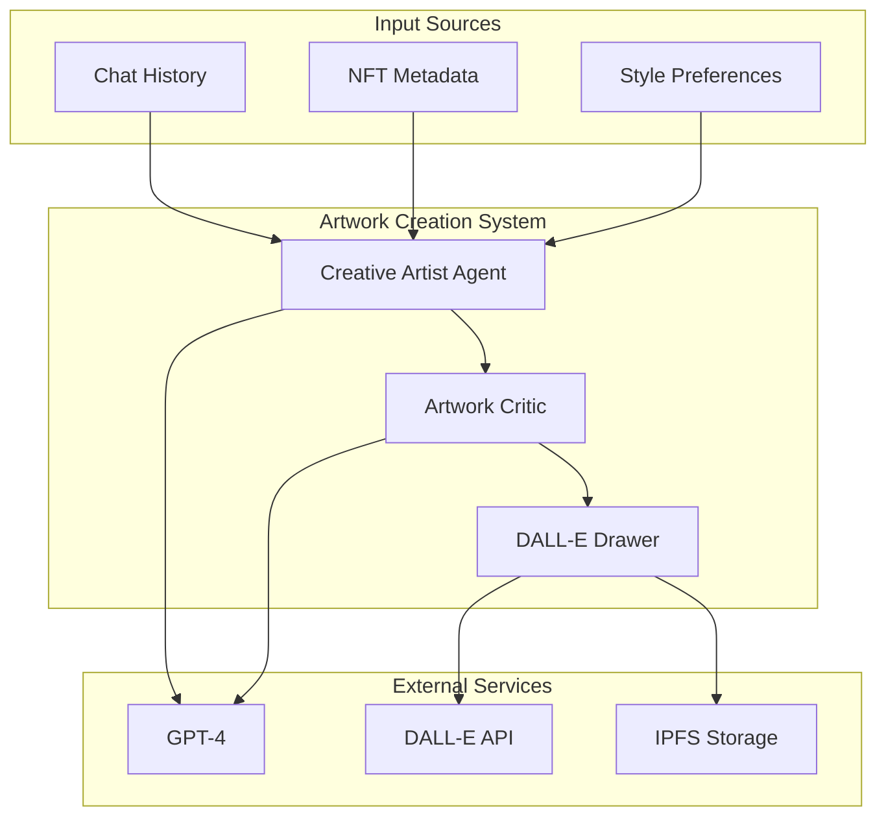

# Artwork Creation System

The Artwork Creation System is responsible for generating AI-powered artwork based on chat interactions and NFT requirements.

## System Architecture



## Core Components

### Creative Artist Agent

```python
from teleAgent.models.agent_model.artwork_creation import CreativeArtistAgent

artwork_creator = CreativeArtistAgent(
    character_profile=profile,
    dalle_config=dalle_config,
    llm_config=llm_config,
    wallet_address=wallet_address,
    agent_id=agent_id
)
```

### Artwork Critic

```python
class ArtworkCritic:
    def __init__(self, llm_config: dict):
        self.llm_config = llm_config
        
    async def evaluate_artwork(self, artwork: dict) -> dict:
        """
        Evaluate generated artwork based on style, composition, and theme
        
        Args:
            artwork: Dictionary containing artwork data and metadata
            
        Returns:
            Dictionary containing evaluation results
        """
        evaluation = await self._analyze_artwork(artwork)
        suggestions = await self._generate_suggestions(evaluation)
        return {
            "evaluation": evaluation,
            "suggestions": suggestions,
            "score": self._calculate_score(evaluation)
        }
```

### DALL-E Integration

```python
class DalleDrawer:
    def __init__(self, config: dict):
        self.api_key = config["api_key"]
        self.model = config["model"]
        self.size = config.get("size", "1024x1024")
        
    async def generate_image(self, prompt: str) -> dict:
        """
        Generate image using DALL-E API
        
        Args:
            prompt: Detailed description for image generation
            
        Returns:
            Dictionary containing generated image data and metadata
        """
        response = await openai.Image.create(
            prompt=prompt,
            n=1,
            size=self.size,
            model=self.model
        )
        
        return {
            "url": response.data[0].url,
            "prompt": prompt,
            "metadata": self._extract_metadata(response)
        }
```

## Creation Workflow

1. **Input Analysis**
   ```python
   async def analyze_inputs(self, chat_history: list, nft_metadata: dict):
       """Analyze chat history and NFT metadata to extract creation parameters"""
       style_elements = await self._extract_style_elements(chat_history)
       theme = await self._determine_theme(nft_metadata)
       return {
           "style": style_elements,
           "theme": theme,
           "color_scheme": self._generate_color_scheme(style_elements)
       }
   ```

2. **Prompt Generation**
   ```python
   async def generate_prompt(self, analysis_result: dict):
       """Generate detailed prompt for DALL-E based on analysis"""
       base_prompt = self._create_base_prompt(analysis_result["theme"])
       style_instructions = self._add_style_instructions(
           analysis_result["style"]
       )
       color_instructions = self._add_color_instructions(
           analysis_result["color_scheme"]
       )
       return f"{base_prompt}\n{style_instructions}\n{color_instructions}"
   ```

3. **Image Generation**
   ```python
   async def create_artwork(self, prompt: str):
       """Generate artwork using DALL-E"""
       try:
           image_data = await self.dalle_drawer.generate_image(prompt)
           evaluation = await self.critic.evaluate_artwork(image_data)
           
           if evaluation["score"] < self.quality_threshold:
               return await self._regenerate_with_improvements(
                   prompt, 
                   evaluation["suggestions"]
               )
           
           return image_data
       except Exception as e:
           logger.error(f"Artwork generation failed: {e}")
           raise ArtworkCreationError(str(e))
   ```

## Usage Examples

### Basic Artwork Creation

```python
# Initialize the artwork creator
artwork_creator = CreativeArtistAgent(config)

# Generate artwork from chat history
artwork = await artwork_creator.create_complete_artwork(messages)
if artwork:
    artwork['drawing'].save("generated_artwork.png")
```

### Advanced Usage with Style Control

```python
# Create artwork with specific style preferences
style_config = {
    "artistic_style": "impressionist",
    "color_palette": "warm",
    "composition": "dynamic",
    "mood": "energetic"
}

artwork = await artwork_creator.create_artwork_with_style(
    messages,
    style_config
)
```

## Storage and Retrieval

```python
async def store_artwork(artwork_data: dict):
    """Store artwork and metadata in IPFS"""
    ipfs_client = IPFSClient(config["ipfs_endpoint"])
    
    # Store image
    image_cid = await ipfs_client.add_file(artwork_data["image"])
    
    # Store metadata
    metadata = {
        "image": f"ipfs://{image_cid}",
        "prompt": artwork_data["prompt"],
        "style": artwork_data["style"],
        "creation_date": datetime.now().isoformat(),
        "evaluation": artwork_data["evaluation"]
    }
    
    metadata_cid = await ipfs_client.add_json(metadata)
    return {
        "image_cid": image_cid,
        "metadata_cid": metadata_cid
    }
```

## Error Handling

```python
class ArtworkCreationError(Exception):
    """Base exception for artwork creation errors"""
    pass

async def handle_creation_error(error: Exception):
    """Handle various artwork creation errors"""
    if isinstance(error, DalleAPIError):
        return await fallback_generation_strategy()
    elif isinstance(error, StorageError):
        return await retry_storage_with_backoff()
    elif isinstance(error, ValidationError):
        return await regenerate_with_fixes()
    raise ArtworkCreationError(f"Unhandled error: {str(error)}")
```

## Best Practices

1. **Quality Control**
   - Implement thorough artwork evaluation
   - Use multiple generation attempts if needed
   - Maintain style consistency

2. **Resource Management**
   - Cache frequently used elements
   - Implement rate limiting
   - Monitor API usage

3. **Storage Strategy**
   - Use distributed storage (IPFS)
   - Maintain metadata relationships
   - Implement backup mechanisms

4. **Error Recovery**
   - Implement graceful fallbacks
   - Maintain partial results
   - Provide clear error messages 