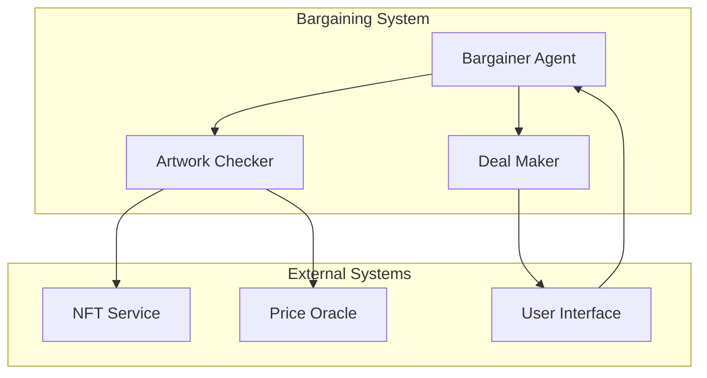

# Bargaining System

The Bargaining System enables automated price negotiations for NFT transactions.

## Architecture Overview



## Components

### Bargainer Agent

```python
from teleAgent.models.agent_model.bargain.bargainer import BargainerAgent

async def create_bargainer(agent_id: str, nft_dao: NFTDAO):
    bargainer = BargainerAgent(
        agent_id=agent_id,
        nft_dao=nft_dao
    )
    return bargainer
```

### Deal Maker

```python
deal_maker = AssistantAgent(
    name="Deal_Maker",
    system_message="""
    Monitor negotiations and confirm deals when agreement is reached.
    Send "CONGRATULATIONS! YOU HAVE MADE A DEAL! TERMINATE" on success.
    Otherwise, send "CONTINUE".
    """,
    llm_config=llm_config
)
```

### Artwork Checker

```python
class ArtworkTools:
    @staticmethod
    def list_artwork() -> Dict[str, str]:
        """List all available artwork"""
        return {
            "NFT": "Digital artwork description",
            "painting": "Physical artwork description"
        }

    @staticmethod
    def estimate_artwork_price(artwork: str) -> str:
        """Estimate artwork price"""
        return f"The estimated price is $100,000"
```

## Negotiation Flow

1. **Initialization**
   ```python
   async def start_negotiation(context: Dict[str, Any]):
       agent_ls = create_bargain_group_chat(
           agent_id='123',
           nft_dao=nft_dao
       )
   ```

2. **Price Discovery**
   ```python
   async def determine_price(artwork_id: str):
       price = await artwork_checker.estimate_artwork_price(artwork_id)
       return adjust_price_range(price)
   ```

3. **Negotiation Process**
   ```python
   async def negotiate(agent_ls, context):
       while True:
           result = await single_round_response(
               agent_ls, 
               context, 
               chat_history
           )
           if is_deal_reached(result):
               return finalize_deal(result)
   ```

## Usage Example

```python
async def run_bargain_chat(
    context: Dict[str, Any],
    nft_dao: NFTDAO,
    artwork_critique_dao: ArtworkCritiqueDAO,
    agent_inner_state: Dict[str, Any]
) -> None:
    agent_ls = create_bargain_group_chat(
        agent_id='7728897257',
        nft_dao=nft_dao,
        artwork_critique_dao=artwork_critique_dao,
        agent_inner_state=agent_inner_state
    )

    while True:
        chat_result = await single_round_response(
            agent_ls,
            context,
            corrected_chat_history
        )
        
        if chat_result.is_deal_reached:
            break
            
        corrected_chat_history.append({
            'content': chat_result.response,
            'role': 'assistant',
            'name': 'Bargainer'
        })
```

## Best Practices

1. **Price Management**
   - Use reliable price oracles
   - Implement price validation
   - Set reasonable price ranges

2. **Negotiation Strategy**
   - Start with market price
   - Allow reasonable negotiation range
   - Set clear termination conditions

3. **Transaction Safety**
   - Verify funds availability
   - Implement escrow mechanism
   - Confirm both parties' agreement

4. **Error Handling**
   - Handle timeout scenarios
   - Manage failed transactions
   - Implement dispute resolution 